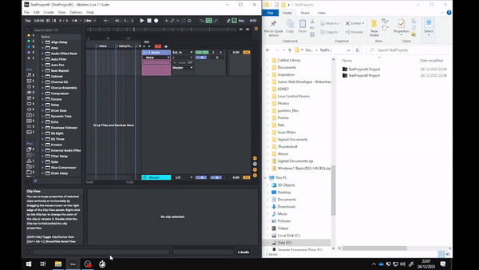

# Ableton Project Timer
#### _Track time spent on Ableton Live projects_
**Platform:** Windows

### Overview
###### This tool is a trusty sidekick for keeping track of how long you are spending on projects. Ableton Project Time Tracker offers a convenient way to monitor and analyze your workflow, allowing you to optimize your creative process.

<a href="https://www.vecteezy.com/free-vector/symbol">Symbol Vectors by Vecteezy</a>